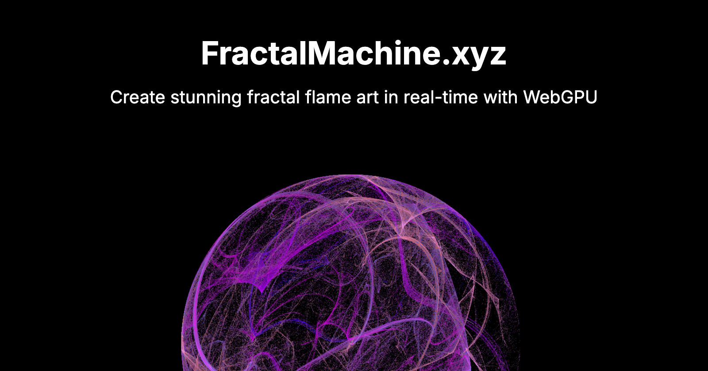

# Electric Sheep GPU 🔥

A high-performance, real-time fractal flame generator powered by WebGPU technology. Create, customize, and share stunning fractal art with hardware-accelerated rendering and an intuitive React interface.



## ✨ Features

### 🎨 **Real-Time Fractal Generation**
- **WebGPU-accelerated rendering** for smooth, real-time fractal computation
- **Chaos game algorithm** implementation with parallel GPU processing
- **Interactive parameter control** with instant visual feedback
- **Multiple fractal variations** including Linear, Sinusoidal, Spherical, and more

### 🎯 **Advanced Controls**
- **Transform editing** with visual overlay system
- **Animation system** with customizable speed controls  
- **Color palette selection** from dozens of built-in colormaps
- **Post-processing effects** including gamma correction, hue/saturation shifts
- **Zoom and pan** with mouse/touch controls
- **Symmetry settings** with rotation and mirror options

### 🤲 **Hand Tracking Control** *(Experimental)*
- Control fractal transforms using **MediaPipe hand tracking**
- **Gesture-based interaction** for immersive creative sessions
- **Real-time hand position mapping** to transform parameters
- Works in fullscreen mode for distraction-free creation

### 🖼️ **Gallery & Sharing**
- **Public gallery** powered by Supabase database
- **Save and share** your fractal creations with the community
- **View statistics** and browse popular fractals
- **Filtering and sorting** by creation date, popularity, and style

### 📤 **Export Capabilities**
- **High-quality PNG export** at full resolution
- **Animated GIF generation** with customizable settings
- **Batch processing** for creating fractal sequences
- **Progress tracking** for long export operations

### 📱 **Cross-Platform Support**
- **Responsive design** optimized for desktop and tablet
- **Mobile detection** with appropriate user guidance
- **Progressive Web App** (PWA) capabilities
- **Touch-friendly controls** for tablet users

## 🚀 Quick Start

### Prerequisites

- **Node.js 18+** 
- **WebGPU-compatible browser**:
  - Chrome 113+ (recommended)
  - Edge 113+
  - Firefox Nightly (with WebGPU enabled)
  - Safari Technology Preview (macOS 13.3+)

### Installation

1. **Clone the repository**
   ```bash
   git clone https://github.com/your-username/electric-sheep-gpu.git
   cd electric-sheep-gpu
   ```

2. **Navigate to the app directory**
   ```bash
   cd electric-sheep
   ```

3. **Install dependencies**
   ```bash
   npm install
   ```

4. **Set up environment variables** (for gallery features)
   ```bash
   cp .env.example .env.local
   ```
   
   Edit `.env.local` with your Supabase credentials:
   ```env
   VITE_SUPABASE_URL=your-supabase-project-url
   VITE_SUPABASE_ANON_KEY=your-supabase-anon-key
   ```

5. **Start the development server**
   ```bash
   npm run dev
   ```

6. **Open your browser** to `http://localhost:5173`

## 🏗️ Architecture

### Core Components

```
electric-sheep/
├── public/                    # WebGPU Engine & Static Assets
│   ├── main.js               # Core WebGPU rendering engine
│   ├── fractal_functions.js  # Fractal math & variations
│   ├── colourmaps.js        # Color palette definitions
│   └── ...
├── src/
│   ├── components/          # React UI Components
│   │   ├── FractalViewer.tsx    # Main fractal interface
│   │   ├── Gallery.tsx          # Community gallery
│   │   ├── FullScreenViewer.tsx # Immersive mode
│   │   └── ui/                  # Reusable UI components
│   ├── hooks/              # Custom React hooks
│   │   ├── useFractalStorage.ts # Supabase integration
│   │   ├── useSEO.ts           # SEO management
│   │   └── useMobileDetection.ts
│   └── types/              # TypeScript definitions
└── ...
```

### Technology Stack

- **Frontend**: React 19.1.0 + TypeScript
- **Build Tool**: Vite 6.3.5 with optimized config
- **GPU Computing**: WebGPU API with WGSL compute shaders
- **UI Framework**: Radix UI primitives with Tailwind CSS
- **Backend**: Supabase (PostgreSQL + Storage)
- **Hand Tracking**: MediaPipe Hands
- **Deployment**: Vercel with custom configuration

## 🎮 Usage Guide

### Getting Started
1. **Launch the app** and wait for the WebGPU engine to initialize
2. **Generate your first fractal** using the "Randomize" button
3. **Explore the controls** in the tabbed interface:
   - **Controls**: Playback, animation, and generation
   - **Visual**: Colors, zoom, and visual effects  
   - **Transforms**: Edit individual fractal transforms
   - **Advanced**: Symmetry, chain settings, and fine-tuning
   - **Export**: Save and share your creations

### Interactive Controls
- **Click and drag** on the canvas to pan
- **Scroll wheel** to zoom in/out
- **Enable Transform Overlay** to see and manipulate transforms visually
- **Toggle animations** for dynamic, evolving fractals

### Saving Your Work
1. Click **"Add to Gallery"** to save to the public database
2. Add a **title and description** for your fractal
3. **Export as PNG** for high-quality static images
4. **Create animated GIFs** to capture fractal motion

## 🗄️ Database Setup (Optional)

For gallery functionality, set up a Supabase project:

```sql
-- Create fractals table
CREATE TABLE public.fractals (
  id UUID DEFAULT gen_random_uuid() PRIMARY KEY,
  title TEXT NOT NULL DEFAULT 'Untitled Fractal',
  description TEXT,
  config JSONB NOT NULL,
  transforms JSONB NOT NULL,
  colormap TEXT NOT NULL DEFAULT 'gnuplot',
  width INTEGER NOT NULL DEFAULT 1024,
  height INTEGER NOT NULL DEFAULT 1024,
  thumbnail_url TEXT,
  full_image_url TEXT,
  gif_url TEXT,
  view_count INTEGER DEFAULT 0,
  created_at TIMESTAMP WITH TIME ZONE DEFAULT TIMEZONE('utc'::text, NOW()) NOT NULL
);

-- Create indexes for performance
CREATE INDEX idx_fractals_created_at ON public.fractals(created_at DESC);
CREATE INDEX idx_fractals_view_count ON public.fractals(view_count DESC);
CREATE INDEX idx_fractals_config_gin ON public.fractals USING GIN (config);
CREATE INDEX idx_fractals_transforms_gin ON public.fractals USING GIN (transforms);

-- Enable public access
ALTER TABLE public.fractals DISABLE ROW LEVEL SECURITY;
```

## 🚀 Deployment

### Vercel (Recommended)

1. **Connect your GitHub repository** to Vercel
2. **Configure build settings**:
   - Build Command: `npm run build`
   - Output Directory: `electric-sheep/dist`
3. **Add environment variables** in Vercel dashboard
4. **Deploy automatically** on git push

The included `vercel.json` handles:
- WebGPU required headers (COOP/COEP)
- Proper MIME types for ES modules
- Client-side routing configuration

### Manual Deployment

```bash
# Build the project
cd electric-sheep
npm run build

# Deploy the dist/ folder to your preferred hosting service
```

## 🧬 Fractal Science

This application implements the **Fractal Flame algorithm** developed by Scott Draves:

- **Iterated Function Systems (IFS)** with nonlinear variations
- **Chaos game rendering** with histogram accumulation  
- **Weighted variation blending** for complex mathematical functions
- **Color interpolation** using curated palettes
- **Real-time parameter animation** for dynamic evolution

### Supported Variations
- Linear, Sinusoidal, Spherical, Swirl
- Horseshoe, Polar, Handkerchief, Heart
- Disc, Spiral, Hyperbolic, Diamond
- Ex, Julia, Bent, Waves, Fisheye
- And many more...

## 🤝 Contributing

We welcome contributions! Here's how to get started:

1. **Fork the repository**
2. **Create a feature branch**: `git checkout -b feature/amazing-feature`
3. **Make your changes** and test thoroughly
4. **Commit with clear messages**: `git commit -m 'Add amazing feature'`
5. **Push to your branch**: `git push origin feature/amazing-feature`
6. **Open a Pull Request**

### Development Guidelines
- Follow TypeScript best practices
- Test WebGPU functionality across browsers
- Maintain responsive design principles
- Document new features and APIs

## 📝 License

This project is licensed under the MIT License - see the [LICENSE](LICENSE) file for details.

## 🙏 Acknowledgments

- **Scott Draves** - Creator of the original Electric Sheep and Fractal Flame algorithm
- **WebGPU Working Group** - For the amazing GPU computing standard
- **React & Vite communities** - For excellent development tools
- **Supabase team** - For the seamless backend solution

## 📚 Additional Resources

- [WebGPU Specification](https://www.w3.org/TR/webgpu/)
- [Fractal Flame Algorithm Paper](https://flam3.com/flame_draves.pdf)
- [Electric Sheep Project](https://electricsheep.org/)
- [MediaPipe Hands Documentation](https://mediapipe.dev/solutions/hands)

---

**Experience the beauty of mathematical art with real-time GPU acceleration** ✨

Made with ❤️ for the creative coding community 